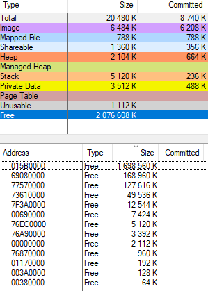

## Набухание Heap'а
Предусловия:
> ОС: Windows7+

> Битность приложения: 32.

Рассмотрим код:
```
void Func()
{
	using SubVector = std::vector<uint8_t>;
	std::vector<SubVector> c;
	try
	{
		for (;;)
		{
			SubVector t(100);
			c.push_back(std::move(t));
		}
	}
	catch (const std::exception&)
	{
		std::cout << "...exception at " << c.size() << "\n";
	}
}
```
*Output:*
> ...exception at 16 548 453


Данный код:
1. наполняет вектор `c` подвекторами с аллокацией в 100 байт (вдаваться в выравнивание и особенности резервирования не будем).
2. вектор `c` периодически расширяется. Каждый раз при расширении для хранения элементов запрашивается в 2 раза больше памяти, чем было до этого.

Все выделения проихсодят через heap. Наблюдаются множественные аллокации среднего размера до 508Кб. Периодически их разбавляют аллокации, вызванные изменением размерности вектора `c`, которые растут со временем и уже через несколько итераций превысят 508Кб. Это приведет к тому, что heap начнет аллоцировать память для них через прямые вызовы VirtualAlloc.


После разрушения вектора и, казалось бы, освобождения памяти, получаем следующую картину распределения виртуальной памяти процесса:


Т.е. heap оставил память зарезервированной, при этом commited size вернулся обратно. И на это никак нельзя повлиять, кроме как удалить этот heap. Но в данном случае heap у нас дефолтный heap процессса и удалить его нельзя!
Ко всему прочему heap может и не возвращать память ОС, т.е. commited size процесса будет велик. И это As Designed [по словам MS](https://support.microsoft.com/en-my/help/3073576/heap-manager-may-not-decommit-memory-after-memory-is-freed).


Теперь попробуем использовать std::pmr::vector из **C++17**:
```
void FuncPmr()
{
	using SubVector = std::pmr::vector<uint8_t>;
    
	std::pmr::vector<SubVector> c;
	try
	{
		for (;;)
		{
			SubVector t(100);
			c.push_back(std::move(t));
		}
	}
	catch (const std::exception&)
	{
		std::cout << "...exception at " << c.size() << "\n";
	}
}
```
*Output:*
> ...exception at 11 958 657

Итоговое число элементов стало меньше, что ожидаемо, т.к. `sizeof` векторов различается:
```
sizeof(std::pmr::vector<uint8_t>) = 16
sizeof(std::vector<uint8_t>)      = 12
```
Размер вектора из `namespace std::pmr` вырос на 4 байта(на x86). Это обусловлено тем, что используется новый аллокатор `std::pmr::polymorphic_allocator`, который реализуется на основе [NVI идиомы](https://en.wikipedia.org/wiki/Non-virtual_interface_pattern), т.е. содержит в себе указатель на `vtable`.

Но после разрушения вектора память также осталась reserved:


Правда здесь свободной памяти побольше, но и занято - меньше. Т.е. проблему это не решает.


Теперь попробуем использовать для аллокаций `resource pool`:
```
void FuncPmrWithPool()
{
	using SubVector = std::pmr::vector<uint8_t>;
    
	std::pmr::unsynchronized_pool_resource pool;

	std::pmr::vector<SubVector> c{&pool};
	try
	{
		for (;;)
		{
			SubVector t(100, &pool);
			c.push_back(std::move(t));
		}
	}
	catch (const std::exception&)
	{
		std::cout << "...exception at " << c.size() << "\n";
	}
}
```
*Output:*
> ...exception at 3 543 306

И это самый худший вариант по полезмному размеру конечного вектора. Он меньше исходного ~3,5 раза. При этом в виртуальном адресном прострастве процесса осталось еще 800Mb свободной памяти и чуть более 500Mb одним куском.


Дело в том, что pool аллоцирует память под объекты в геометрической прогрессии и для аллокации следующего `chunk'а` потребовалось ~654Mb, которых одним куском не оказалось.


Отсюда можно сделать вывод, что если pool не сможет найти память для `chunk'а` одним куском, то он(точнее его upstream_allocator) сгенерирует исключение `std::bad_alloc`.

Подтверждение:
```
void FuncPmrPool()
{
	std::pmr::unsynchronized_pool_resource pool;

	try
	{
		for (;;)
			pool.allocate(1);
	}
	catch (const std::exception&)
	{
		std::cout << "...exception\n";
	}
}
```
В пике:


После разрушения пула:


При всём при этом после разрушения пула reserved size heap'а уменьшается до адекватных значений:



Что уже можно считать успехом, но с большой оговоркой.


### Выводы:
При переходе на C++17 можно использовать новые механизмы для управления памятью - `memory_resources`. Которые как раз и призваны решить проблемы с длительно работающими приложениями в которых присутствуют частые аллокакции (см. Bjarne Stroustrup - A Tour of C++ (2nd Edition) 13.6 Allocators).
Однако стоит понимать, что pool'ы на требовательных к памяти частях могут не только расходовать больше памяти, чем реально требуется, но и значительно уменьшать максимально возможное количество объектов. Но, несмотря на это, после разрушения пула они позволяют избавиться от распухания reserved size heap'а. 