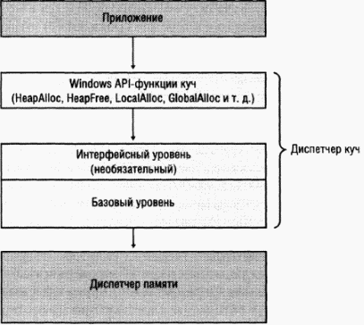

## Heap

В Windows на текущий момент(2019 год) существует 2 типа heap'ов:
### NT Heap
Данный тип может иметь дополнительную интерфейсную прослойку - **LFH** (Low Fragmentation Heap).



В Windows до WinXP & WinServer2003 включительно для включения LFH необходимо использовать функцию [HeapSetInformation](https://docs.microsoft.com/en-us/windows/win32/api/heapapi/nf-heapapi-heapsetinformation). Во всех последующих версиях Windows она включена по умолчанию, за исключением некоторых случаев:
* Если heap создается с флагом `HEAP_NO_SERIALIZE`.
* Если heap создается с фиксированным размером.
* Если используются средства отладки heap'а, например, такие как ApplicationVerifier или Debugging Tools for Windows!

LFH состоит из bucket'ов. Всего в ней содержится 128 bucket'ов, каждый из которых используется для выделения блоков определенных размеров.
Так первый bucket используется для выделения памяти от 1 до 8 байт. Последний - 128-ой bucket - от 15 873 байт до 16Кб. Все аллокации выше 16Кб прослойкой LFH не обрабатываются и передаются в heap.
Такая стратегия выделения памяти эффективна за счет обработки блоков одного размера. Для устранения проблем с масштабируемостью LFH раскрывает часто используемые внутренние структуры в набор слотов, в два раза больший текущего количества процессоров в компьютере. Закрепление потоков за этими слотами выполняется LFH-компонентом, называемым диспетчером привязки (affinity manager). Изначально LFH использует для распределения памяти первый слот, но, как только возникает конкуренция при доступе к некоторым внутренним данным, переключает текущий поток на другой слот. И чем больше конкуренция, тем большее число слотов задействуется для потоков. Эти слоты создаются для bucket'а каждого размера, что также увеличивает локальность и сводит к минимуму общий расход памяти.

Аллокации более ~508Кб на heap'е приводят к прямой аллокации через `VirtualAlloc`.


### Segment Heap (Win10+)
Новый тип, который на текущий момент можно включить только через реестр:
```
[HKLM\SYSTEM\CurrentControlSet\Control\Session Manager\Segment Heap]
"Enabled":DWORD=1
```
Включает использование Segment Heap для всех процессов.

Или можно включить для конкретного процесса:
```
[HKLM\SOFTWARE\Microsoft\Windows NT\CurrentVersion\Image File Execution Options\(executable)]
FrontEndHeapDebugOptions:DWORD=
Bit 2 (0x04): Disable Segment Heap
Bit 3 (0x08): Enable Segment Heap"Enabled":DWORD=1
```

##### Принцип аллокаций:

В Segment Heap есть две интерфейсные прослойки:
    * LFH
    * VariableSize
    
* Для блоков до 16Кб:
    * если heap детектирует блоки, как часто аллоцируемыми, то используется LFH прослойка.
    * если же нет, то используется VariableSize прослойка.
* Для блоков до 128Кб, не обслуживаемых LFH, используется VariableSize прослойка.
* Для блоков от 128Кб до 508Кб используется внутренняя прослойка heap.
* Для блоков более 508Кб используются прямые вызовы `VirtualAlloc`.

Помимо алгоритма аллокации Segemnt Heap отличается от NT Heap и внутренним устройством. Подробнее об этом можно посмотреть [здесь](https://www.blackhat.com/docs/us-16/materials/us-16-Yason-Windows-10-Segment-Heap-Internals.pdf).