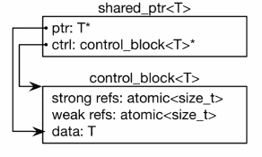
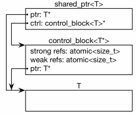

## Рекомендации для предотвращения фрагментации виртуального адресного простраства процесса
##### Создавать отдельные Heap'ы для маложивущих объектов.
Для парсеров и различных конвертеров, где происходит множество аллокаций маленькими блоками создавать отдельные heap’ы на время их работы, либо использовать `std::pmr::memory_resource` (начиная с C++17).

##### Использовать W-версии функций WinAPI.
\[Джеффри Рихтер\]\[2009\] Windows via C&C++. Программирование на языке Visual C++
> Стандартная куча процесса необходима многим Windows-функциям. Например, функции ядра Windows выполняют все операции с использованием Unicode-символов и строк. Если вызвать ANSI-версию какой-нибудь Windows-функции, ей придется, преобразовав строки из ANSI в Unicode, вызывать свою Unicode-версию. Для преобразования строк ANSI-функции нужно выделить блок памяти, в котором она размещает Unicode-версию строки. Этот блок памяти заимствуется из стандартной кучи вызывающего процесса.

##### Использовать `std::make_shared` против `std::shared_ptr {new T}`
В типичной реализации, std::shared_ptr содержит только два указателя:
* указатель на объект владения
* указатель на *control block*, который является динамически-созданным объектом, включающим в себя:
    * указатель на объект T или сам объект T.
    * функцию удаления объекта
    * аллокатор
    * счетчик указателей shared_ptr, владеющих объектом T.
    * счетчик указателей weak_ptr, которые ссылаются на объект T.

Когда shared_ptr создан вызовом `std::make_shared` или `std::allocate_shared`, *control block* содержит сам объект T, в качестве члена структуры данных.



Когда указатель `shared_ptr` создан вызовом его конструктора, *control block* содержит указатель на объект T.



Т.е. в этом случае происходит на 1 аллокацию больше.


##### Для реализации опциональности члена данных структуры использовать `optional`
Иногда для реализации опциональности какого-либо члена данных в классе\структуре используется `std::unique_ptr`. Это плохо, тем, что объект, который хотели сделать опциональным теперь выделяется в heap'е.
Вместо этого правильнее использовать именно `std::optional`(C++17), либо `boost::optional`, которые позволяют опционально создавать объекты внутри себя.

##### Использовать функторы вместо lambda-функций
Иногда для выполнения каких-либо действий перед уничтожением объекта используется следующая конструкция:
```
std::unique_ptr<T, std::function<void(T*)>> scoped{new T, [](auto *obj) {...}};
```

Вместо этого правильнее в этом случае использовать функтор:
```
struct ScopedDeleterFunctor
{
    auto operator() (T *obj) { return ...; }
};

std::unique_ptr<T, ScopedDeleterFunctor> scoped { new T };
```

Несмотря на всю новомодность решения с lambda, оно является тяжеловесным. В чем конкретно это выражается можно почитать [здесь](functorVSlambda.md).